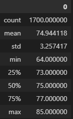
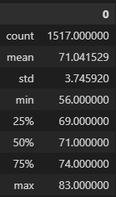

# Surfs Up Analysis Report
Prepared by Robert Gallagher

## Overview
The following analysis takes weather data collected from several weather stations in Hawaii.  This data is stored in a sqlite database that we access using the following Jupyter notebook python script:
[SurfsUp Script](SurfsUp_Challenge.ipynb)
Specifically we are looking at weather data for the months of June and December to try and determine if it makes sense to open a surf and ice cream shop in Oahu.

## Results
- June results

- December results

- The minimum tempeture is lower in December than in June but only by a few degrees.
- The mean tempetures for both months are in the 70s
- And most of the tempetures even in December are still in the 70s

## Summary

- Overall the tempertures in June and December are high enough for a surf and ice cream shop to be successful.
- Additonal queries that might be worth checking are one that looks at percipitation amounts months.  And one that maybe looks at average temps and percipitation by month for the whole year of data.